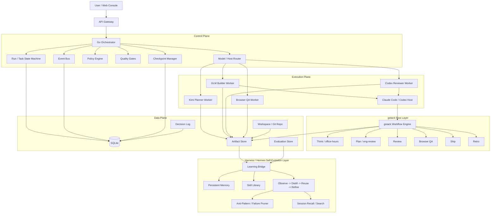
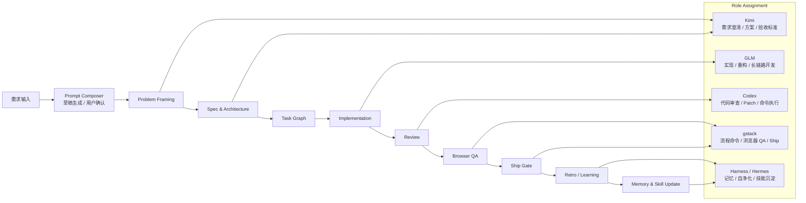
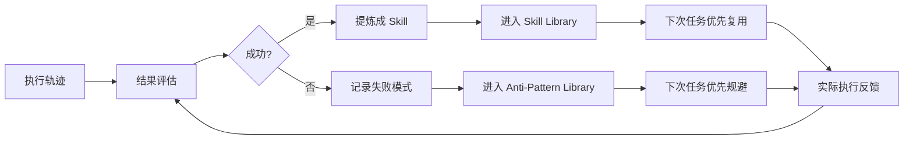

# AI Dev Platform

一个面向 **内部研发团队** 的单机版 AI 开发编排平台。

## 项目定位

**一个确定性的 Go 编排内核**  
**+ gstack 的流程层**  
**+ Harness/Hermes 风格的自进化学习层**  
**+ Kimi / GLM / Codex 三个角色化模型工种**。

该平台运行在 **Mac mini（16GB）** 等本地开发机器上，通过 **Web 控制台 + Go 后端 + SQLite + tmux/PTY + 代码 Agent 宿主** 的方式，实现多终端、多 Agent、长时间运行、任务编排、资源调度、容错恢复等能力。

当前版本目标是构建一个 **MVP（最小可用版本）**，优先解决以下问题：

- 用 Web 界面统一管理 AI 开发任务
- 启动、托管、控制多个代码 Agent
- 支持多个终端会话与日志回放
- 支持任务拆分、排队、运行、暂停、恢复、终止
- 在资源有限的机器上实现稳定运行
- 在内存/CPU 紧张时自动降载、暂停、驱逐、恢复
- 为后续基于 **Kimi / GLM / Codex** 的多模型协作开发流程提供统一运行底座

---

## 1. 项目定位

本项目不是一个公开的 SaaS 平台，也不是一个“聊天机器人外壳”。  
它的定位更接近于：

> **内部使用的单机版 AI 软件开发调度台 / Agent OS**

它负责把如下能力统一起来：

- 任务管理
- Agent 生命周期管理
- 多终端管理
- AI 编码工具托管
- 工作区隔离
- Git 操作
- 测试执行
- 资源调度
- 审计日志
- 容错恢复
- 开发流程门禁（review / QA / ship）
- 经验沉淀与技能自修复

平台优先服务于以下场景：

- 需求分析
- 代码生成 / 修改
- 自动化测试
- 代码审查
- 问题修复
- 长时间后台运行的研发任务
- 研发流程标准化
- 经验沉淀与失败模式净化

---

## 2. 当前状态（很重要）

### 已经完成

- Go 服务启动主链路（配置加载、数据库初始化、迁移、API 启动）
- SQLite 持久化与基础迁移
- 项目 / Run / Task / Agent / Terminal / Checkpoint / Event 等核心领域模型
- Repository 层
- 基础 REST API
- tmux 终端会话管理与 WebSocket 终端输出
- Scheduler / Watchdog / Reconciler 基础骨架
- Next.js Web 控制台基础壳

### 正在进行

- WorkflowTemplate 驱动的任务实例化与状态推进
- Runtime / Host 抽象收敛
- Workspace / Git 管理能力与任务执行链衔接
- 终端、Agent、任务之间的关系强化

### 还未真正完成

- Kimi / GLM / Codex 的角色化宿主接入
- gstack 流程层集成
- Harness/Hermes 风格的记忆与自进化学习层
- 真实的多模型协作闭环
- 基于流程门禁的 review / QA / ship 收敛机制

换句话说：

> 当前仓库已经完成了 **平台底座**，正在从“调度平台骨架”迈向“真正可用的多模型研发 Agent 平台”。

---

## 3. 这版架构想实现什么

本项目最终希望做到两件事同时成立：

### 3.1 有 gstack 的开发流程能力

也就是把 AI 开发从“一次性 prompt”升级为“可确认的提示词草稿 + 稳定流程”：

```text
用户原始输入 -> Prompt Draft -> 用户确认 -> Think -> Plan -> Build -> Review -> QA -> Ship -> Retro
```

平台要先把用户的自然语言输入生成一版结构化提示词草稿，允许用户编辑确认，再把确认后的 prompt 送入稳定可重复的工程流程。这样既降低输入门槛，也避免系统黑盒改写用户意图。

### 3.2 有 Harness/Hermes 风格的自进化能力

这里的“自进化”不是指模型自己乱改，而是指：

- 持久记忆
- 从复杂任务中提炼技能（skills）
- 在技能使用过程中自动修补技能
- 记录失败模式并在后续主动规避
- 搜索过去会话与运行轨迹
- 将成功路径固化、将坏路径净化掉

所以平台最终追求的是：

> **流程标准化 + 经验可沉淀 + 失败可净化 + 多模型可协作**

---

## 4. 总体架构



### 这张图怎么理解

- **Go Orchestrator** 是唯一总控，负责状态、调度、准入、恢复、终止。
- **gstack Flow Layer** 负责把研发流程变成有顺序的交付链。
- **Execution Plane** 负责真正执行任务，不同模型在不同角色位上工作。
- **Harness / Hermes Self-Evolution Layer** 负责记忆、技能提炼、失败模式净化、经验复用。
- **Data Plane** 是所有运行事实与产物的落点。

---

## 5. 功能模块图



### 关键思想

- **Kimi** 负责想清楚。
- **GLM** 负责做出来。
- **Codex** 负责挑毛病、补漏洞、把代码落稳。
- **Prompt Composer** 负责把用户原始输入整理成可编辑、可确认的结构化提示词。
- **gstack** 负责把流程走完整，不跳过 review / QA / ship。
- **Harness / Hermes** 负责把经验沉淀成下次更稳定的行为。

---

## 6. 角色与宿主（Execution Profiles）

| 角色 | 宿主 / 接入方式 | 主要职责 |
|---|---|---|
| Planner | Kimi API Worker | 需求澄清、方案设计、验收标准、任务拆分 |
| Builder | Claude Code Host + GLM | 长链路开发、跨文件修改、第一版实现 |
| Reviewer | Codex CLI Worker | 审查 diff、补丁修复、命令执行 |
| Flow / QA / Ship | gstack Sidecar | 流程约束、浏览器 QA、发版门禁、复盘 |
| Learning | Harness / Hermes Bridge | 记忆沉淀、技能生成、失败模式净化 |
| Supervisor | Go Scheduler / Watchdog | 并发控制、资源调度、驱逐、恢复 |

### 当前实现与目标的区别

当前仓库已经实现的是：

- 通用 shell / tmux 运行底座
- API / 调度 / 存储 / 终端基础设施

而最终目标是：

- 在这个底座上接入 **Kimi / GLM / Codex / gstack / Harness** 的角色化执行层

---

## 7. 核心模块

### 7.1 API Layer

负责：

- REST API
- WebSocket 推送
- Project / Run / Task / Agent / Terminal 对外访问入口

### 7.2 Orchestrator

负责：

- Run / Task 状态机推进
- WorkflowTemplate 实例化
- 任务拆分
- Agent 分配
- 执行顺序控制
- Gate 触发与下一阶段推进

### 7.3 Resource Scheduler / Supervisor

负责：

- 系统资源采样
- Agent 准入控制
- 并发数量限制
- 内存 / CPU 压力判断
- 暂停 / 驱逐 / 恢复 Agent
- 看门狗机制

### 7.4 Agent Runtime Manager

负责：

- 启动 / 停止 Agent
- 托管 AI 编码进程
- 记录心跳
- checkpoint 保存与恢复
- 统一宿主生命周期

### 7.5 Terminal Manager

负责：

- 管理 tmux session / pane
- 管理 PTY
- 终端 attach / detach
- 终端输出流实时推送
- 输出日志落盘

### 7.6 Workspace / Git Manager

负责：

- 创建工作区
- checkout 分支
- 管理任务独立 workspace
- 读取 diff / status
- 提交变更

### 7.7 gstack Flow Layer

负责：

- Think / Plan / Review / QA / Ship / Retro 流程串联
- 接收用户确认后的 prompt，并将它升级为稳定流程
- 作为 review / qa / ship 的门禁层

### 7.8 Harness / Hermes Learning Layer

负责：

- 持久记忆
- Skills 提炼与管理
- 失败模式记录
- Anti-pattern 净化
- 会话检索与经验回放
- 将成功路径转为可复用技能

### 7.9 Audit / Event Log

负责：

- 写入结构化事件日志
- 保存原始终端输出日志
- 保存决策与执行证据
- 为恢复、排障、审计提供依据

---

## 8. MVP 的运行对象

### Project

表示一个代码仓库项目。

### Run

表示一次完整执行，例如：

- “实现退款接口”
- “修复某个 bug 并补测试”

### Task

表示 Run 内的一个子任务，例如：

- planner
- coder
- tester
- reviewer
- qa
- ship

### AgentInstance

表示一个运行中的 Agent 实例。

### Workspace

表示某个任务对应的独立工作目录。

### TerminalSession

表示某个 tmux / PTY 终端会话。

### Artifact

表示一个阶段产物，例如：

- spec.md
- patch.diff
- review.md
- qa_report.json
- learned_skill.md

---

## 9. 推荐的最小工作流

第一版建议先固化 5 个角色：

- **Planner**：负责理解需求与输出任务目标
- **Builder**：负责写代码 / 改代码
- **Reviewer**：负责检查代码质量和问题
- **QA**：负责运行浏览器验证与回归检查
- **Learning**：负责将结果写入经验层

### 最小工作流

```text
需求输入
  ↓
Prompt Composer（草稿生成 / 用户确认）
  ↓
Planner（Kimi）
  ↓
Builder（GLM）
  ↓
Reviewer（Codex）
  ↓
QA / Ship（gstack）
  ↓
Learning（Harness / Hermes）
  ↓
结果收敛
```

这个版本比原始的 Planner / Coder / Tester / Reviewer 更贴近你当前要做的多模型架构。

---

## 10. 自进化层设计（对照 Harness / Hermes 能力）

这里的“自进化”不是让模型自己失控，而是做成一条 **可控的闭环**：



### 10.1 Failure Capture

统一记录失败任务的：

- 上下文
- 任务目标
- 执行轨迹
- 失败原因
- 修复结果

### 10.2 Pattern Distiller

将成功路径提炼为：

- 可复用的 Skill
- Review Checklist
- QA Checklist

### 10.3 Skill Patcher

当 Skill 失效、过时、不完整时，自动补充：

- 缺失步骤
- 新的验证方法
- 更安全的边界条件

### 10.4 Memory Promotion / Demotion

- 成功且稳定的经验：提升为 durable memory
- 短期、偶发、误导性的经验：降级或剔除

### 10.5 Anti-Pattern Pruner

把反复导致失败的模式显式记录下来，让后续流程主动绕开。

这部分是你后续最有特色的能力之一。

---

## 11. 长时间运行设计原则

本系统的设计重点之一是：

> **在本地资源有限的机器上，让多个 AI Agent 可以长时间稳定运行。**

为实现这一点，必须具备以下机制：

### 11.1 心跳机制

每个运行中的 Agent 定期上报：

- 当前状态
- 最近输出时间
- 最近心跳时间
- 资源占用信息

### 11.2 Checkpoint

系统在以下时机写 checkpoint：

- 周期性保存
- 阶段完成时保存
- 驱逐前保存
- 异常恢复前保存

### 11.3 Watchdog

监控以下异常：

- 长时间无输出
- 心跳超时
- 进程崩溃
- 终端断开

### 11.4 自动恢复

资源恢复后，系统可以：

- 从 checkpoint 恢复任务
- 重建终端会话
- 重新启动受管 Agent

---

## 12. 资源调度策略

由于平台运行在 **Mac mini 16GB** 上，必须采用资源感知调度。

### 12.1 设计原则

- 不是追求最多并发
- 而是追求“有限资源下的稳定吞吐”

### 12.2 建议默认限制

- 同时活跃 Agent：**2 个**
- 同时重型任务：**1 个**
- 同时测试任务：**1 个**

### 12.3 内存压力分级

- **NORMAL**：< 70%
- **WARN**：70% - 80%
- **HIGH**：80% - 88%
- **CRITICAL**：> 88%

### 12.4 对应策略

#### NORMAL

- 正常准入
- 正常恢复排队任务

#### WARN

- 停止重型任务准入
- 新任务进入队列

#### HIGH

- 暂停低优先级 Agent
- 暂停非关键任务
- 禁止新任务进入运行态

#### CRITICAL

- 先 checkpoint
- 再驱逐 / 终止低优先级且可恢复 Agent
- 保证主控服务存活

### 12.5 关键设计要求

系统不是“内存超了就直接乱杀进程”，而是：

1. 先判断优先级
2. 先暂停再驱逐
3. 驱逐前尽量保存 checkpoint
4. 资源恢复后再继续执行

---

## 13. 模型 / CLI / Host 接入策略

### 13.1 GLM

- 通过 **Claude Code Host** 接入
- 角色：Builder
- 负责主实现与长链路开发

### 13.2 Kimi

- 通过 **API Worker** 接入
- 角色：Planner
- 负责需求澄清、方案、验收标准

### 13.3 Codex

- 通过 **官方 Codex CLI Worker** 接入
- 角色：Reviewer
- 负责 diff 审查、补丁修复、命令执行

### 13.4 gstack

- 作为 **Host Sidecar** 挂在 Claude Code / Codex 宿主旁边
- 负责流程命令、review、browser QA、ship、retro

### 13.5 Harness / Hermes

- 作为 **Learning Bridge / Persistent Runtime** 接入
- 负责长期记忆、skill 生成、skill 自修补、失败模式净化

### 13.6 平台必须坚持的原则

1. **模型层可替换**
   - 平台不应绑定单一模型供应商
2. **模型只负责推理与执行，不负责平台控制**
   - kill / 恢复 / 排队 / 驱逐必须由平台后端控制
3. **AI 输出必须可审计**
   - 所有关键决策、命令、输出摘要都应记录
4. **AI 流程必须可中断 / 恢复**
   - 避免一次长链调用失控

---

## 14. 代码结构（当前仓库实际结构）

```text
xxyCodingAgents/
├─ cmd/
│  └─ server/
│     └─ main.go
├─ configs/
│  └─ config.yaml
├─ docs/
│  ├─ development-plan.md
│  ├─ task-list.md
│  └─ reports/
├─ internal/
│  ├─ api/
│  ├─ audit/
│  ├─ config/
│  ├─ domain/
│  ├─ orchestrator/
│  ├─ runtime/
│  ├─ scheduler/
│  ├─ storage/
│  ├─ terminal/
│  └─ workspace/
├─ web/
├─ data/
└─ README.md
```

### 当前代码与模块映射

- `cmd/server`：启动入口
- `internal/config`：配置加载与默认值
- `internal/storage`：SQLite、migrations、repos
- `internal/domain`：核心领域模型
- `internal/api`：HTTP / WS API
- `internal/orchestrator`：Run / Task 编排
- `internal/scheduler`：调度器 / watchdog / reconciler
- `internal/runtime`：AgentRuntime 抽象与基础 adapter
- `internal/terminal`：tmux 管理与输出采集
- `internal/workspace`：workspace / git 管理
- `web`：Next.js 控制台

---

## 15. 数据存储建议

SQLite 中至少应包含以下对象：

- projects
- runs
- tasks
- agent_instances
- workspaces
- terminal_sessions
- checkpoints
- resource_snapshots
- events
- command_logs
- task_specs
- agent_specs
- workflow_templates

建议开启：

- WAL 模式
- foreign key
- busy timeout

---

## 16. 配置建议（MVP）

```yaml
server:
  http_addr: ":8080"
  pprof_addr: "localhost:6060"

runtime:
  workspace_root: "./data/workspaces"
  log_root: "./data/logs"
  checkpoint_root: "./data/checkpoints"

scheduler:
  tick_seconds: 3
  max_concurrent_agents: 2
  max_heavy_agents: 1
  max_test_jobs: 1

thresholds:
  warn_memory_percent: 70
  high_memory_percent: 80
  critical_memory_percent: 88
  disk_warn_percent: 80
  disk_high_percent: 90
  workspace_max_size_mb: 2048
  log_retention_days: 7
  max_total_log_size_mb: 1024
  max_child_processes_per_agent: 10

timeouts:
  heartbeat_timeout_seconds: 30
  output_timeout_seconds: 900
  stall_timeout_seconds: 900
  checkpoint_interval_seconds: 30

sqlite:
  path: "./data/app.db"
  wal_mode: true
  busy_timeout_ms: 5000
```

---

## 17. API 方向（当前与目标）

### 当前已实现的主要接口

#### 项目

- `POST /api/projects`
- `GET /api/projects`
- `GET /api/projects/{id}`

#### Run

- `POST /api/runs`
- `GET /api/runs`
- `GET /api/runs/{id}`
- `GET /api/runs/{id}/timeline`
- `GET /api/projects/{id}/runs`

#### Task

- `GET /api/runs/{id}/tasks`
- `GET /api/runs/{id}/workflow`
- `POST /api/tasks/{id}/retry`
- `POST /api/tasks/{id}/cancel`

#### Agent

- `GET /api/agents`
- `GET /api/agents/{id}`
- `POST /api/agents/{id}/pause`
- `POST /api/agents/{id}/resume`
- `POST /api/agents/{id}/stop`

#### Terminal

- `GET /api/terminals`
- `POST /api/terminals`
- `GET /api/terminals/{id}`
- `GET /api/terminals/{id}/ws`

#### System

- `GET /api/system/metrics`
- `GET /api/system/diagnostics`

#### Specs / Template

- `GET /api/task-specs`
- `GET /api/agent-specs`
- `GET /api/workflow-templates`
- `POST /api/workflow-templates`

---

## 18. 开发原则

### 18.1 优先顺序

当前建议的推进顺序如下：

1. 平台底座稳定化（已基本完成）
2. Runtime / Host 抽象收敛
3. Kimi / GLM / Codex 角色化 Worker 接入
4. gstack Flow Layer 集成
5. Harness / Hermes Learning Bridge 集成
6. 基于 Gate 的闭环收敛

### 18.2 架构原则

- 单机优先
- 简单优先
- 稳定优先
- 可恢复优先
- 人工可接管优先
- 流程清晰优先于模型自由发挥

### 18.3 明确不做

在 MVP 阶段，不做以下事情：

- 复杂平台抽象
- 大规模插件系统
- 过早微服务拆分
- 过度通用化设计
- 模型自由自治式乱协作

---

## 19. 当前阶段成功标准

### 平台底座成功标准

- 可以通过 Web 创建一个 Project / Run
- 可以为 Run 创建并查看 Task
- 可以启动至少 2 个受管 Agent / Shell Session
- 可以在 Web 中看到终端输出
- 可以查看事件时间线
- 可以在内存压力升高时暂停 / 驱逐低优先级 Agent
- 被驱逐任务可以从 checkpoint 恢复
- 系统可以持续运行较长时间而不失控

### 下一阶段成功标准

- Kimi / GLM / Codex 三角色真正跑起来
- gstack review / QA / ship 流程接入
- Harness / Hermes 学习桥接入
- 形成 `Plan -> Build -> Review -> QA -> Learn` 的闭环

---

## 20. 后续演进方向

MVP 完成后，未来可以逐步增加：

- 更丰富的 Agent 角色
- 更强的 Git 流程集成
- 更细的命令审批机制
- 更智能的任务拆分与重试策略
- 更完善的日志检索和运行分析
- 更丰富的模型适配层
- 更强的本地 / 远程执行隔离
- 更成熟的自进化技能系统

但这些都应建立在：

> **MVP 先稳定可用**

的前提上。

---

## 21. 许可证与使用范围

本项目当前定位为：

- 内部工具
- 单机部署
- 非公开服务

是否开源、是否开放公共使用、是否支持多租户，由后续阶段再决定。

---

## 22. 一句话总结

这是一个：

> **基于 Go + Web + SQLite + tmux/PTY 的单机版 AI 开发调度平台 MVP**

它面向内部研发使用，运行在本地 Mac mini 上，强调：

- 多 Agent 执行
- 长时间稳定运行
- 资源感知调度
- 容错与恢复
- gstack 式流程标准化
- Harness / Hermes 风格的经验沉淀与自进化
- 为后续基于 **Kimi / GLM / Codex** 的 AI 开发流程提供可靠底座
